Communication
=============

The sprint is attended by people from various timezones, so expect more
asynchronous discussions throughout the sprint.

We will be using Discord to communicate during the sprint. See the
:ref:`Discord Guide` for more details.

Additionally we will use Zoom for the kick-off and send-off meetings and for
group video chats.

Starting a new meeting
----------------------

You're free to schedule a meeting with another participant anytime. When you
scheduled a meeting, please add the meeting to the shared Google Calendar.
Once you add the meeting to Google Calendar, it will be automatically announced
on Discord. Other sprint attendees will be able to discover your scheduled
meeting, and join in if they're interested too.

Remember to take notes during your meeting!

Note taking
-----------

We heard that people didn't like HackMD from last year's sprint. So this time
we have decided to use Google Docs. We will be creating the Google Docs and
share the links.

When you're in a group meeting, please remember to take down notes, so those
unable to attend the meeting can get up speed.

We have created a Google Doc for each project. You can find the link to
the notes in :ref:`projects`. We will ensure that each participant will
have access to all the docs as it gets closer to the sprint.

.. _Discord Guide:

Discord Setup Guide
===================

Welcome to the Discord setup guide! The information in this guide is mostly
specific to sprint participants, and will cover:

- :ref:`Privacy settings`
- :ref:`Audio settings`
- :ref:`UI settings`
- :ref:`Joining Python Discord`
- :ref:`Channel structure & navigation`
- :ref:`Renaming categories & creating new channels`

For additional details that cover the fundamentals of using Discord in general,
I would recommend their `Beginner’s Guide <https://support.discord.com/hc/en-us/articles/360045138571-Beginner-s-Guide-to-Discord>`_.
I’ll go over some basics, but the above guide is more detailed for first-time users.

For those who are very familiar with using Discord, feel free to skip to “Joining Python Discord”.

As a very general Discord recommendation, I would advise downloading the desktop
client at https://discord.com/download. Generally, it looks and functions
better as a full-screen desktop application rather than in the browser as a web
application, but either works reasonably well.

If anything is unclear, either within this guide or in using Discord in
general, feel free to reach out to the author directly at aeros167@gmail.com or
via DM on discuss.python.org to aeros.

.. _Privacy settings:

Privacy settings
----------------

Prior to joining any public server (especially highly populated ones), it is
recommended to configure account privacy settings to disallow DMs from server
members, and strictly allow friend requests from existing friends.

After clicking the gear box in the lower left corner, proceed to
“User Settings > Privacy & Safety”:

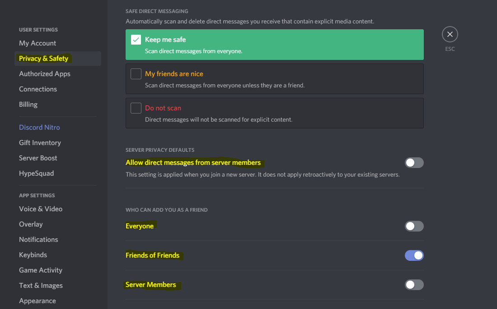

In the above image, the relevant options are highlighted:

“Allow direct messages from server members”: **Off**. Without this setting, any
member on a mutual server would be able to directly send messages.

“Who can add you as a friend?”: **Friends of Friends only**. Using this setting,
only those who are friends with your existing friends will be able to send
friend requests. This requires at least one mutual friend in order for others
to add you, but it will drastically reduce the pool of potential users that can
send friend requests.

As for that one mutual friend, **I would recommend for participants to send a
friend request to aeros#0717**, and then add each other. This would allow each
participant of the sprint to easily DM anyone they’ve added.

For participants that don’t have a substantial public following, simply disabling DMs from server members and allowing anyone to add you as a friend will likely be sufficient. The above recommended settings are to ensure minimization of undesired contact. Less restrictive settings will make it easier to add others, so it might be worth starting with those and making them more strict as needed. This setup usually works well for me, with only a few intermittent random friend requests.

The options below this area contains additional settings related to privacy
between the user and Discord. Since these are purely personal decisions and
have no direct impact on the sprint, it will not be covered in this guide.

.. _Audio settings:

Audio settings
--------------

The default settings can work reasonably well prior to joining, but I have a few specific recommendations based on my own experience with Discord.

The audio settings can be accessed by clicking the lower left gearbox and going to “App Settings > Voice & Video”.

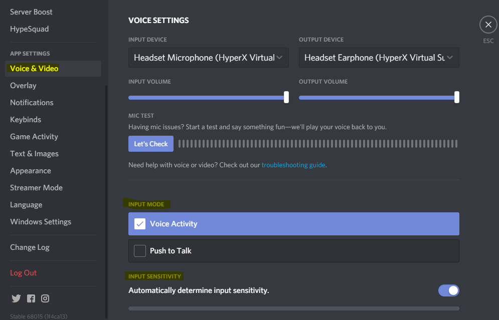

At the top of the page, it is worth briefly verifying that the input/output
devices match the ones that are desired to use, such as selecting your headset
instead of built-in audio. Also, be sure to click “Let’s Check” to verify that
discord is able to pick up on your voice.

As for the recommended input settings, it depends upon local audio setup. 

If relying on a built-in area mic such as for a phone or laptop, I would
strongly recommend usage of “Push to Talk” (otherwise, it will likely pick up
on any background noise). Otherwise, if using a headset (with some noise
cancellation) or dedicated microphone (with a pop filter), “Voice Activity”
with “Automatically determine input sensitivity” generally works well.

The “Video settings” section below allows you to select an external recording
device (such as for face cam), and below that are more advanced audio
settings. I generally leave these on the defaults, but experimenting with them
may be worthwhile if you are experiencing issues with your voice not being
detected (such as disabling “Noise Suppression”, “Noise Reduction”, and/or
“Advanced Voice Activity”). For further troubleshooting, I’d recommend
`Discord’s guide <https://support.discord.com/hc/en-us/articles/360045138471-Discord-Voice-and-Video-Troubleshooting-Guide>`_.

.. _UI settings:

UI settings
-----------

This will be the most opinionated part of the guide, and if you are satisfied with the default settings, this part can be safely skipped. However, I personally like to use a compact mode that minimizes extraneous elements (such as profile pictures) to fit more messages on the screen, while still having a font size and spacing large enough to easily read. This is more similar to an IRC style, for those familiar with it.

The UI settings can be accessed by clicking on the user settings gearbox in the lower left and going to “App Settings > Appearance”:

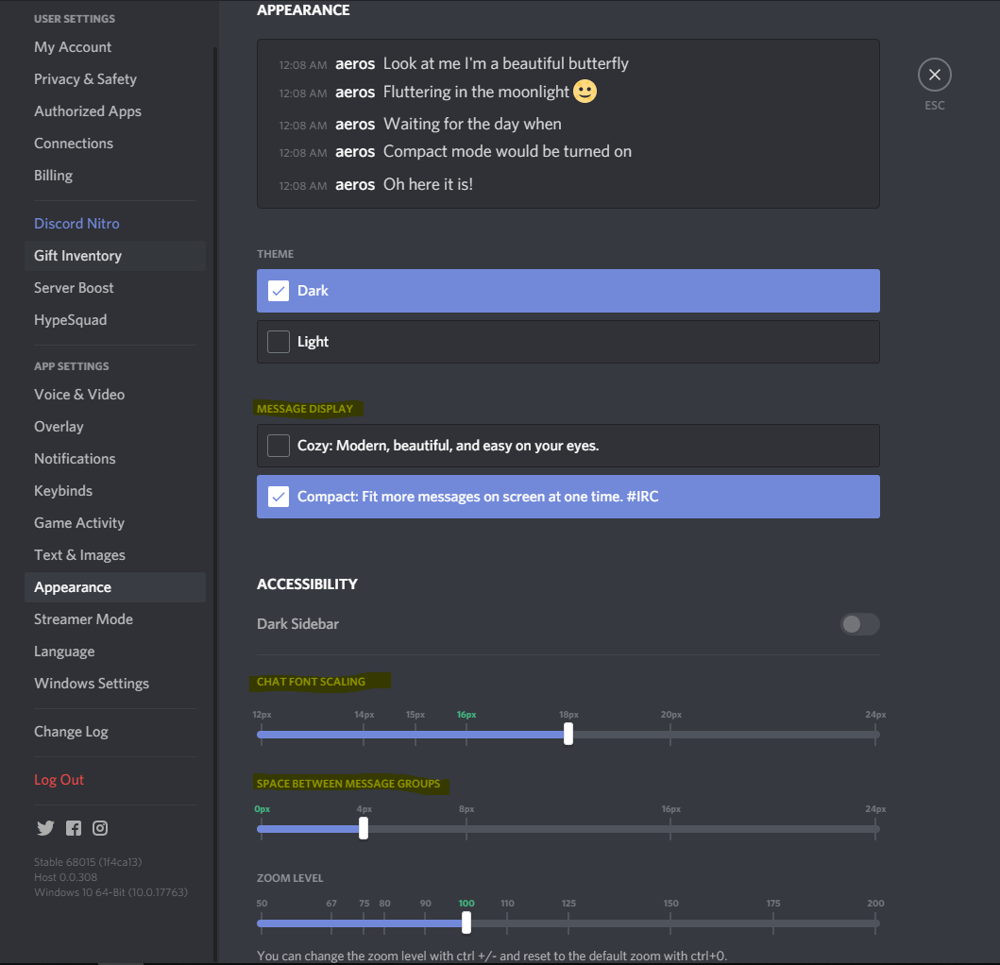

My recommended settings are:

“Message Display”: “Compact”

“Chat font scaling”: 18px

“Space between message groups”: 4px

Of course, this can easily be tweaked as needed to increase font size or
spacing based on eyesight, screen resolution, and personal preferences. On
smaller resolutions, adjusting the zoom size will make it easier to see more
channels at once.

.. _Joining Python Discord:

Joining Python Discord
----------------------

Python Discord (the public server where the sprint is being hosted) can be joined through the following perma-link: https://discord.gg/Q87A9Y9. 

If you haven’t already, I’d recommend creating a discord account prior to joining, and double-checking that your personal privacy settings are as intended.

When first joining the server, you will see a limited preview until verifying (this is to prevent/limit bot accounts from joining). In order to do so, click on the channel titled “verification”:

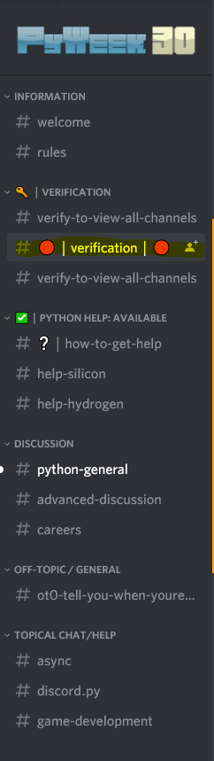

Next, simply type “!accept” within the chat and press enter after reading over
the server rules (they are very brief and mostly common sense). Welcome to
Python Discord!

At this point, if it is before the start of the sprint, you will likely see
the standard layout of channels within the server that are viewable by all
verified users. Feel free to explore around if you’re curious, notably
“python-general”, “advanced-discussion”, and the topical channels might be of
interest.

Prior to the sprint, all participants will be granted a sprint participant
role on the server that will allow them to see the channels we will be using
throughout the sprint. In order to do this, an announcement will be sent out
to collect IDs ahead of time, and then a script will be used to automatically
grant the role to everyone that provided their ID.

However, for this to work, participants must already be on the server (in order
to give them the role). If the sprint has already started or you are joining
the server late, reach out directly to an organizer of the event (such as
myself, at aeros167@gmail.com) and we can grant you the role manually after
joining.

.. _Channel structure & navigation:

Channel structure & navigation
------------------------------

After being granted the sprint participant role, you will see something like the following channel layout at the top of the server:

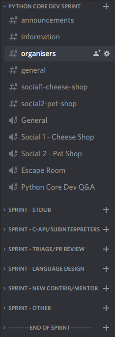

These categories are where the sprint will be primarily taking place, and will
only be visible to participants and the admin team at Python Discord (other
than the Q&A voice channel, which will be opened to users of the server to join
muted on Oct. 20th when it takes place).

Discord uses two primary types of channels: text channels and voice channels.
Text channels are indicated by a pound/hash (#) symbol to the left of the name,
and voice/video channels are indicated by the audio symbol (🔊). Any channel
can be joined simply by left-clicking on it.

You can simultaneously view a text channel while being present in a voice
channel. This is done by simply left-clicking the text channel after joining
the voice channel. Typically, the corresponding intended text channel will have
a similar name; e.g. “general” for the text channel and “General” for the
voice channel, or in a nearby pair like “discussion” and “voice” within a
category. This way, those without a mic can listen in and respond via text, or
other content like links, images, or code blocks (standard markdown format) can
be shared in the text channel.

For example, this is what it might look like while being in the “General” voice
channel while simultaneously viewing the “general” text channel (with the
contents of the channel appearing in the center of the screen).

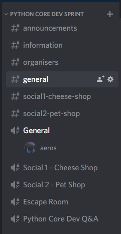

The next component to be aware of are categories, which act as a visual means
to separate groupings of channels. They can be expanded or collapsed either by
left-clicking on individual categories or on platforms where available,
**ctrl+shift+a** to toggle collapse/expand all channels.

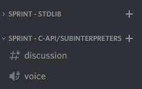

As for the overall channel layout, the sprint encompasses all categories
starting from “Python Core Dev Sprint” all the way down to the separator
“END OF SPRINT”. Below that contains the typical channels viewable by all users
on Python Discord.

The first category, “Python Core Dev Sprint”, contains the following: 

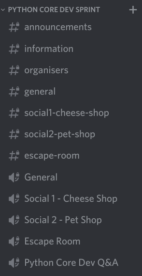

- announcements - used for communicating event and sprint project start times
   as well as general reminders that are relevant to all participants.

- information - will contain a link to this guide and contact info of
   organizers for help.

- general/General - used as a general-purpose chat room for all participants
   and location to ask questions that are not specific to a sprint project.

- social<n>/Social <N> - used as channels for general social activities or
   unstructured chatting. This is a great location to take a break from working on
   a project and leisurely talk to other participants.

- Escape Room - specifically used for participation in the virtual escape room
   social activity.

- Python Core Dev Q&A - used for hosting the community -> core dev Q&A
   session taking place on Oct. 20th. Note that this channel will be the only
   publicly viewable and joinable channel by users of the server (muted), so
   it’s not suited for private discussions.

The remaining categories are for individual sprint projects, with each
containing at least one pair of voice/text channels to use. For example:

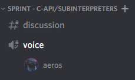

These channels should be used whenever working collaboratively on a specific
project, and the category or channel name should reflect the project being
worked on. This will make it easy for other sprint participants to easily see
what others are working on and change between projects as desired.

The last “Sprint - Other” channel will be used as an overflow category, in case
all other sprint project categories are currently occupied.

While working on a specific project, I’d recommend collapsing the other sprint
categories. Icons of participants in other voice channels will still be
visible, and can be clicked on to see who it belongs to. This helps to
minimize overall visual clutter, and easily locate relevant channels.

The last important general channel usage topic are voice channel specific
features, such as screen sharing, enabling video, muting, and deafening. After
joining a voice channel, the following menu should be visible in the lower left
of of your application:

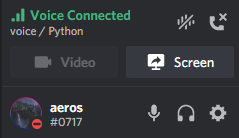

Clicking on “Screen” will open a menu that allows you to screen share a
specific application or monitor, which will be visible to other participants in
the channel. “Video” can be clicked on for showing a webcam (or other video
device). The phone with the x can be used to leave the channel. The mute/deafen
ones below it are fairly self-explanatory, with the mic being the universal
mute icon and the headphones being deafen.

.. _Renaming categories & creating new channels:

Renaming categories & creating new channels
---------------------------------------------

In order to minimize the total amount of visual clutter while still providing
enough channels, we created 5 separate categories that can be reused for
different projects. The current naming is based on the sprint projects with the
most interested participants, but we’ve provided permissions for participants
to easily change the name of each category. This should be done only if there
is nobody else present within the voice channels (within the category) and a
category for your sprint project is not listed. 

Also, **“Sprint - Stdlib” and “Sprint - Other” should NOT be renamed**.
“Stdlib” will contain several channel pairs for each module, and “Other” is
used as overflow.

In order to rename a category, simply right click on it and select
“Edit Category”. In the center of the screen, the following will appear: 

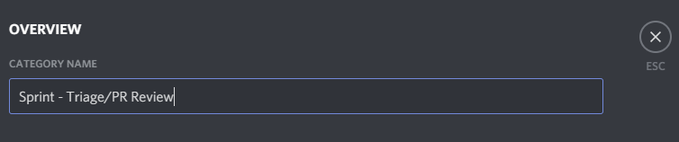

Then, after the “Sprint - “, write the name of your project. For example, if
you wanted to work on the PEG parser, it could be renamed to “Sprint - PEG
Parser”. Then, press “Save Changes” at the bottom to update the name:

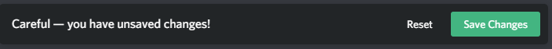

If all sprint project categories have participants in their voice channel(s),
instead of renaming a category, a new text/voice channel pair can be added
within “Sprint - Other”. This can be done by clicking on the “+” icon to the
right of the channel name:

.. image:: images/discord-guide-13.png

Then, the following menu will appear:

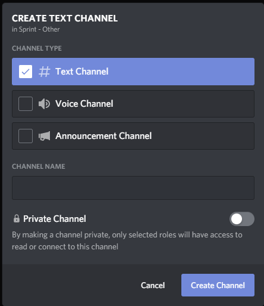

Within this menu, you can add new text or voice channels. For example, for
working on Documentation, you might add a text channel titled “documentation”
with a corresponding voice channel titled “Documentation”. This is what it
would look like:

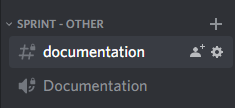

Note that the permissions will be inherited based on the parent category, so
any newly added channels will have the same restrictions to only being viewable
by sprint participants (and server admins).

There’s no hard limitation as to the number of channels that can be created,
but to keep the total count to a minimum to make things easier to keep track
of, we may periodically delete extra channels at the end of the sprint days.
So, make sure to record any important information such as meeting notes within
the google doc assigned to your project (or create a separate one if there
isn’t). The doc for each project can be accessed via :ref:`projects`.
